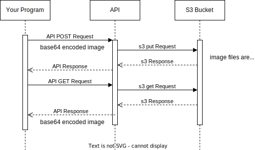

# Communication Contract

### About

This microservice allows the user to upload and retieve images from an s3 bucket through a REST api. The data in the api requests and responses will be base64 econded binary. Therefore when making a POST request the image must first be encoded and when making a GET request the response data will need to be decoded.

## A. Requesting Data

GET Request

endpoint: https://5p53jt8p6e.execute-api.us-west-2.amazonaws.com/images/?imageID={image_id}

query parameter containing the id of the image you are requesting is required

API request can be made in your python program using the requests library

```
requests.get(https://5p53jt8p6e.execute-api.us-west-2.amazonaws.com/images/?imageID=your_image_id)
```

POST Request

endpoint: https://5p53jt8p6e.execute-api.us-west-2.amazonaws.com/images/
body must include imageID and base64 encoded binary of the image you wish to store

```
body = {
"imageId": "your_image_id",
"base64Image": "VGVzdCBiYXNlNjQgZW5jb2RlZCBzdHJpbmc="
}
```

To encode your png or jpg image file you can use the base64 library

```
with open(file_path, "rb") as image:
base64_image = base64.b64encode(image.read()).decode("utf-8")
```

Use the requests library to send the POST request

```
requests.post("https://5p53jt8p6e.execute-api.us-west-2.amazonaws.com/images/", {"imageId": "your_image_id", "base64Image": base64_image})
```

## B. Receiving Data

GET Requests

The get endpoint will return a standard JSON response containing statusCode: 200 if succesfully and data: base64_string

To use the image it will need to be decoded. In python, you can use the base64, io, and pillow libraries to convert it to a useable form.

1. store the response in a variable

    `response = requests.get(url)`

2. extract the encoded string from the data portion of the response

    `base64_string = response.json()['data']`

3. decode and convert to BytesIO obeject which is compatibile with PIL

    `image_file = BytesIO(base64.b64decode(base64_string))`

4. use open to turn it into a usable object

    `image = Image.open(image_file)`

POST Requests

The post endpoint will return status code 200 if the image was uploaded sucessfully.

## UML Sequence Diagram


